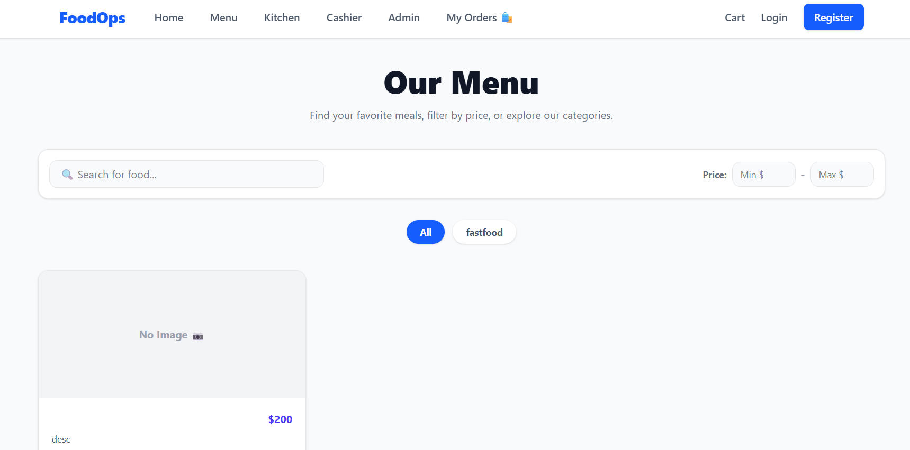
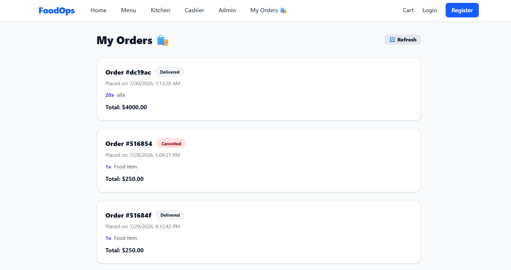
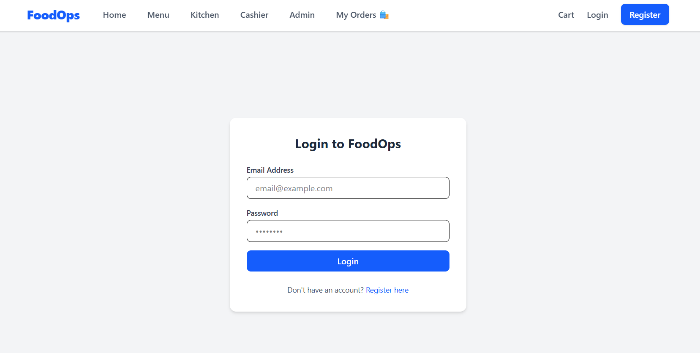
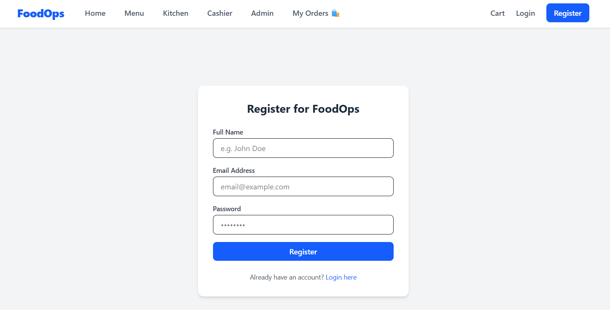
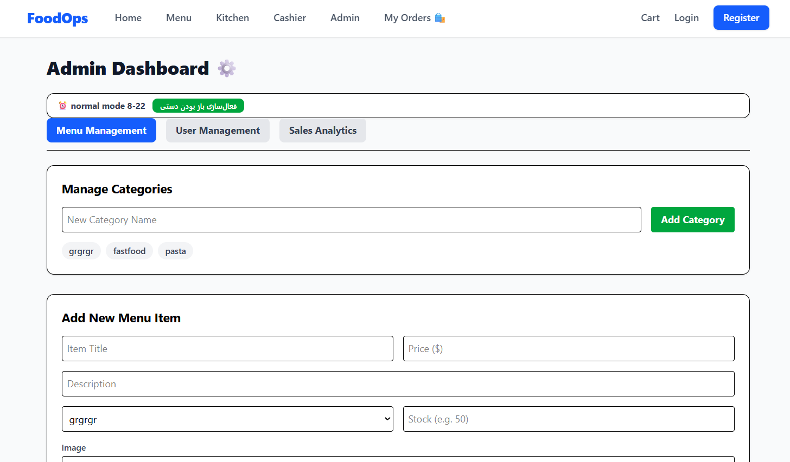

# 🍔 FoodOps (NoshFlow) - Restaurant Management System


FoodOps (internally codenamed **NoshFlow**) is a comprehensive, full-stack restaurant management and food ordering application. It features a strict **Role-Based Access Control (RBAC)** architecture that seamlessly connects Customers, Kitchen Staff, Cashiers, and Administrators into a single synchronized flow.

## 🏗 System Architecture

The project follows a modern RESTful architecture separating the client side (React) from the server side (Node.js/Express) with MongoDB acting as the NoSQL data layer.


---

## ✨ Key Features by Role

The system enforces strict RBAC, ensuring users only access what they are authorized to see:

### 👤 Customer
* **Digital Menu:** Browse categories, search, and filter food items.
* **Smart Cart:** Dynamic stock validation prevents adding out-of-stock items or exceeding inventory.
* **Checkout & Discounts:** Apply validation-backed discount codes during checkout.
* **Order Tracking:** Live countdown timer estimating order prep time in the `My Orders` dashboard.

### 👨‍🍳 Kitchen Staff
* **Kitchen Dashboard:** Real-time visibility into registered orders.
* **Workflow:** Move orders from `Registered` ➡️ `Preparing` ➡️ `Ready for Delivery`.

### 🛵 Cashier / Delivery
* **Delivery Dashboard:** View orders marked as `Ready for Delivery`.
* **Fulfillment:** Finalize the workflow by marking orders as `Delivered`.

### 👑 Administrator
* **Menu Management:** Add/edit/delete categories and menu items with image uploads and stock management.
* **User Management:** Change user roles dynamically.
* **Sales Analytics:** View bar charts (via Recharts) displaying revenue from `Delivered` orders over the last 7 days.
* **Restaurant Status Toggle:** Override system working hours (default 08:00–22:00) with a 24/7 force-open manual switch.

---

## 📸 Screenshots

| Menu View | My Orders (Live Countdown) |
| :---: | :---: |
|  |  |

| User Login | User Registration |
| :---: | :---: |
|  |  |

### ⚙️ Admin Dashboard


---

## 🛠 Tech Stack

**Frontend:**
* React 18 + Vite
* Tailwind CSS (Styling)
* React Router DOM (Routing & Protected Routes)
* Recharts (Data Visualization)
* Context API (Global Cart State)

**Backend:**
* Node.js & Express.js
* MongoDB & Mongoose (ODM)
* JSON Web Tokens (JWT) & bcryptjs (Security)
* Multer (Image Uploads)

**DevOps & Testing:**
* GitHub Actions (CI/CD Pipelines)
* Vitest & Supertest (Integration Testing)
* MongoDB Memory Server (Isolated test databases)

---

## 📂 Project Structure

```text
NoshFlow/
├── .github/workflows/       # GitHub Actions CI/CD pipelines
├── backend/
│   ├── config/              # Database connection setup
│   ├── controllers/         # Business logic (admin, auth, menu, order, discount)
│   ├── middlewares/         # Auth (JWT), RBAC, File Upload, Working Hours logic
│   ├── models/              # Mongoose schemas (User, Role, Order, MenuItem, Setting)
│   ├── routes/              # Express API definitions
│   ├── scripts/             # DB seeding scripts (seedRoles.js)
│   ├── tests/               # Vitest integration tests (auth, discount, menu, order)
│   ├── utils/               # Helpers (e.g., precise priceCalculator)
│   ├── server.js            # Express entry point
│   └── vitest.config.mjs    # Test configuration
├── frontend/
│   ├── public/              # Static assets (Favicons, SVG)
│   ├── src/
│   │   ├── components/      # Reusable UI (FoodCard, Navbar)
│   │   ├── context/         # React Context (CartContext)
│   │   ├── data/            # Mock data for initial frontend design
│   │   ├── pages/           # Views (Login, Menu, Cart, MyOrders, Dashboards)
│   │   ├── pages/__tests__/ # Frontend component tests
│   │   └── App.jsx          # Protected Routes configuration
│   └── vite.config.js       # Vite configuration
├── docs/                    # Architecture diagrams and API.md
├── PENDING.md               # Developer tasks & blockers tracker
└── TODO.md                  # Agile development roadmap