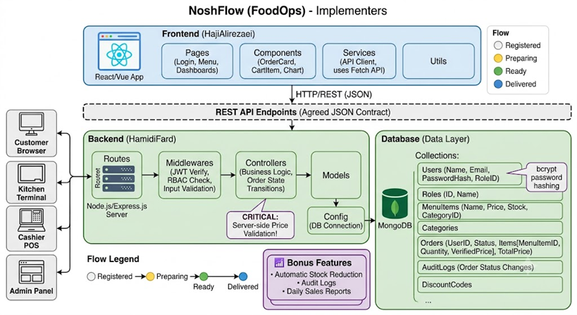

# FoodOps Project - TODO & Workflow Guide
## 1. Project Architecture

1. Client / Frontend Layer
   This layer runs in the user's browser and is responsible for user interaction and displaying data.

Technologies: Utilizes base HTML, CSS, and JavaScript, along with allowed frameworks such as React or Vue (and styling tools like Tailwind/Bootstrap).

State Management: The state of the shopping cart, user login status, and the real-time status of orders are managed within this layer.

Server Communication: Communication with the backend layer is done exclusively through the Fetch API, exchanging data in JSON format.

User Interfaces: Includes completely separate panels for four different roles: Customer (viewing the menu and tracking orders), Kitchen Staff (viewing the order queue), Cashier (final delivery), and Admin (reports and system management).

2. Server / Backend Layer
   This layer represents the core business logic of the system that processes client requests.

Technologies: Uses the Node.js runtime environment along with the Express.js framework to develop the application's Routes.

Internal Architecture: The code is modularly separated into Routes (routing), Controllers (main logic), and Models (data models).

Middlewares: These play a very important role in this layer and are used for parsing tokens, authenticating, and enforcing Role-Based Access Control (RBAC) before the request reaches the Controllers.

Critical Computational Logic: The calculation of the final price of orders is performed exclusively in this layer; the server never trusts the price sent by the client.

3. Database (Data Layer)
   This layer is responsible for the permanent and secure storage of information.

Technology: Utilizes a NoSQL database, specifically MongoDB.

Data Structure: Data is modeled in separate, structured Collections, which include Users, Roles, MenuItems, Categories, and Orders.

Bonus Features: If bonus sections are implemented, collections such as audit_logs are added to this layer to meticulously record the history of order status changes.

4. Security and Access Control Architecture
   Security flows across all layers of this architecture:

Authentication: Based on JWT (JSON Web Tokens) that have an expiration date and are stored in the client's browser.

Encryption: User passwords are hashed using the bcrypt algorithm before being saved in the database.

Authorization: The system operates on Role-Based Access Control (RBAC) to prevent ordinary users from accessing admin routes, and to ensure kitchen staff cannot interfere with the cashier's duties.

Database Protection: Strict validation of input data is enforced to prevent NoSQL Injection attacks.

## 2. General Git & Branching Guide
Before starting any feature, ensure the correct branch is created and you are isolated from the main codebase.

1.  **Sync with main development:** Run `git checkout develop` and `git pull`.
2.  **Frontend (HajiAlirezaei):** Create your branch using `git checkout -b feature/fe-<feature_name>`.
3.  **Backend (HamidiFard):** Create your branch using `git checkout -b feature/be-<feature_name>`.
4.  **Completion:** Never commit directly to `develop` or `main`. Once a feature is done and tested, open a Pull Request (PR) to merge into `develop`.

---

## 3. Team Communication & Handoff Protocol
To maintain an Agile workflow and ensure no one is blocked, use the following message templates in your team chat to signal your status:

* 🟢 **Start:** "I have created the branch `feature/<name>` and started working on `<feature>`."
* 🟡 **Frontend Mocking:** "I am building the UI with mock data while waiting for the Backend API."
* 🔵 **Backend Done (Handoff):** "I have completed the backend API for `<feature>` and pushed the code. You can integrate it now."
* 🟠 **Frontend Waiting:** "I have finished the UI. Waiting for the API endpoints to connect them."
* ✅ **Integration & Test:** "Integration is complete. Tested successfully / Bugs found."

---

## 4. AI Usage Guide (Feature Implementation)
When using AI to help develop a specific feature, follow this strict sequence to ensure clean and integrated code:

1.  **Branch Check:** Ensure your specific feature branch is created and active.
2.  **API Contract Agreement:** Before asking the AI to write code, Frontend and Backend must agree on the JSON structure for the request/response.
3.  **Prompting the AI:** * **Frontend Prompting:** Tell the AI: *"I am working on the Frontend using React/Vue. Here is the agreed JSON API response. Generate the UI component and the Fetch API logic using mock data."*
    * **Backend Prompting:** Tell the AI: *"I am working on the Backend using Node.js/Express and MongoDB. Here is the agreed JSON contract. Generate the Mongoose schema and the Express route controller for this endpoint."*

*(Note: The exact, detailed prompts for each specific feature will be provided in the next sequence as requested).*

---

## 5. Step-by-Step Feature Implementation List

### Phase 1: Infrastructure & Setup
* [ ] **Frontend (HajiAlirezaei):** Initialize the frontend framework (React/Vue) and setup styling tools/folder structure.
    * *Status:* ✅ Done
    * *Handoff Message:* "Frontend infrastructure is ready."
* [ ] **Backend (HamidiFard):** Setup Node.js, Express.js, and connect to the MongoDB database.
    * *Status:* ✅ Done
    * *Handoff Message:* "Server is up and connected to the database."

### Phase 2: Database & Authentication
* [ ] **Backend (HamidiFard):** Design Collections (`Users`, `Roles`), implement Registration/Login routes, generate JWT, apply `bcrypt` password hashing, and setup RBAC middleware.
    * *Status:* ✅ Done
    * *Handoff Message:* "Auth APIs are ready. JWT is being generated."
* [ ] **Frontend (HajiAlirezaei):** Design Login/Register forms, implement frontend validation, store JWT securely in the browser, and attach it to API request headers.
    * *Status:* ✅ Done
    * *Handoff Message:* "Auth forms are connected to the API and JWT is stored."

### Phase 3: Menu & Cart Logic
* [ ] **Backend (HamidiFard):** Design `MenuItems` and `Categories` collections. Write APIs to fetch the menu list. **Crucial:** Implement server-side price calculation and validation (do not trust client-side prices).
    * *Status:* ✅ Done
    * *Handoff Message:* "Menu APIs are ready and price validation is strict on the server."
* [ ] **Frontend (HajiAlirezaei):** Design menu cards UI (name, description, price, add button). Implement cart state management in the browser and DOM events for adding/removing items.
    * *Status:* ✅ Done
    * *Handoff Message:* "Menu UI is displaying data and Cart logic works."

### Phase 4: Order Management (Customer)
* [ ] **Backend (HamidiFard):** Write the final order submission API. Set the initial order status to "Registered" (`ثبت‌‌شده`) and design the `Orders` collection.
    * *Status:* ✅ Done
    * *Handoff Message:* "Order submission API is live."
* [ ] **Frontend (HajiAlirezaei):** Design the order tracking page for the customer, utilizing colored labels to differentiate order statuses.
    * *Status:* ✅ Done
    * *Handoff Message:* "Customer order tracking UI is connected."

### Phase 5: Staff Dashboards (Kitchen & Cashier)
* [ ] **Backend (HamidiFard):** Write APIs to update order statuses sequentially (Preparing -> Ready for Delivery -> Delivered). Ensure Role-Based Access Control so only specific staff can trigger these updates.
    * *Status:* ✅ Done
    * *Handoff Message:* "Status update APIs are ready for staff."
* [ ] **Frontend (HajiAlirezaei):** Design separate, distinct panels for Kitchen staff (to view the queue) and the Cashier (for final delivery). Add status update buttons connected to the API.
    * *Status:* ⬜ Pending | ⏳ In Progress | ✅ Done
    * *Handoff Message:* "Staff dashboards are ready and buttons change order statuses."

### Phase 6: Admin Panel & Reports
* [ ] **Backend (HamidiFard):** Write APIs for managing user roles, fetching daily sales statistics, and generating data for charts.
    * *Status:* ⬜ Pending | ⏳ In Progress | ✅ Done
    * *Handoff Message:* "Admin and Reporting APIs are providing data."
* [ ] **Frontend (HajiAlirezaei):** Design the Admin panel to manage the menu. Implement graphical charts to display daily sales and reports visually.
    * *Status:* ⬜ Pending | ⏳ In Progress | ✅ Done
    * *Handoff Message:* "Admin UI and charts are successfully rendering data."

### Phase 7: Security & Bonus Features
* [ ] **Backend (HamidiFard):** Implement NoSQL Injection prevention. Add bonus logic: automatically reduce item stock upon order, and create an `audit_logs` collection to track exact order status history.
    * *Status:* ⬜ Pending | ⏳ In Progress | ✅ Done
* [ ] **Frontend (HajiAlirezaei):** Implement bonus logic: Search and filter functionality for menu items, display approximate prep time, and visually disable "Add to cart" buttons for out-of-stock items.
    * *Status:* ⬜ Pending | ⏳ In Progress | ✅ Done

## 5. Project Dependencies & Blockers

Understanding dependencies is crucial to know when a team member might be blocked and needs to wait for the other's output. Below are the dependencies for each phase to add to your `TODO.md` file:

* **Phase 1: Infrastructure & Setup**
  * **Prerequisite:** None.
  * **Details:** This is the starting point for both. HajiAlirezaei can set up the frontend folders, and HamidiFard can initialize the server and database independently.

* **Phase 2: Database & Authentication**
  * **Prerequisite:** Completion of Phase 1.
  * **Blockers:** Parallel development is entirely possible here. However, the Frontend (HajiAlirezaei) is blocked from doing the final test of storing the JWT until the Backend (HamidiFard) has fully implemented the JWT generation system.

* **Phase 3: Menu & Cart Logic**
  * **Prerequisite:** Completion of Phase 2 (Specifically Authentication).
  * **Blockers:** The Frontend can build the cart's UI using mock data, but real API integration is blocked until the user can get a valid token (so the cart is registered to them). In the backend, the final price calculation is strictly dependent on the database setup, as the server must never trust the price sent from the frontend.

* **Phase 4: Order Management (Customer)**
  * **Prerequisite:** Completion of Phase 3.
  * **Details:** An order cannot be submitted until the "Add to Cart" button and the cart logic are working correctly. The output of this phase (an order saved with the "Registered" status) is a critical prerequisite for the next phase.

* **Phase 5: Staff Dashboards (Kitchen & Cashier)**
  * **Prerequisite:** Completion of Phase 4.
  * **Details:** Kitchen staff need to view orders in a queue. These are the exact orders submitted by the customer in Phase 4. Therefore, developing these staff panels is impossible without having the customer order registration logic in place first.

* **Phase 6: Admin Panel & Reports**
  * **Prerequisite:** Completion of Phases 3, 4, and 5.
  * **Details:** Reports and charts require actual data. Until a menu exists and orders are successfully registered and delivered, there will be no data available to generate "Daily Sales Reports" or to manage users.

* **Phase 7: Security & Bonus Features**
  * **Prerequisite:** Flawless operation of the main project workflow (all previous phases).
  * **Details:** You cannot implement the "Automatic Stock Reduction" feature unless the order submission cycle is fully complete and bug-free. Similarly, creating `audit_logs` for order status changes is completely dependent on the completion of the staff dashboards from Phase 5.

## 6. Project Directories and Structure
```
NoshFlow/
│
├── backend/ # HamidiFard workspace
│ ├── src/
│ │ ├── config/ # MongoDB database connection interface
│ │ ├── controllers/ # API core logic
│ │ ├── middlewares/ # Authentication functions (JWT) and RBAC
│ │ ├── models/ # Database collection schema
│ │ └── routes/ # Express-related endpoints
│ ├── .env # Sensitive environment variables (port, secret key, etc.)
│ └── server.js # Backend server entry point
│
├── frontend/ # HajiAlirezaei workspace
│ ├── src/
│ │ ├── assets/ # Images, icons, and generic CSS files
│ │ ├── components/ # Reusable components (menu cards, buttons)
│ │ ├── pages/ # Main pages (Customer Dashboard, Kitchen Panel)
│ │ ├── services/ # Fetch API logic to connect to the server
│ │ └── utils/ # Helper functions (like price or date formatting)
│
├── .gitignore # To prevent uploading the node_modules folder and .env file to GitHub
├── README.md # Documentation for introducing and implementing the project for the teacher
└── TODO.md
```
## 7. PENDING Guide (Blocked Tasks & Waiting List)
To manage cross-dependencies and prevent the development process from being blocked, we use the `PENDING.md` file. The rules for utilizing this file are as follows:

* **Purpose:** To transparently and accurately track tasks that you need your teammate to complete so you can finish a phase (e.g., Frontend waiting for an API, or Backend waiting for an agreed JSON structure).
* **When to use (Crucial):** You are **only allowed** to add an item to the `PENDING.md` file if you have already started and fully implemented your independent portion of that phase (e.g., Frontend has built the forms with Mock Data, or Backend has written the core controllers).
* **When NOT to use:** If you have not yet started your own tasks for a phase, you must not write anything in this file. You cannot be "waiting" on a teammate if your own foundational code for that phase hasn't been written! Progress as far as possible independently first, and only log an item here when you are genuinely blocked.
* **Resolution:** Once the requested task is completed and pushed by the other developer, the person who resolved the blocker is responsible for striking through or deleting the corresponding item from `PENDING.md`.